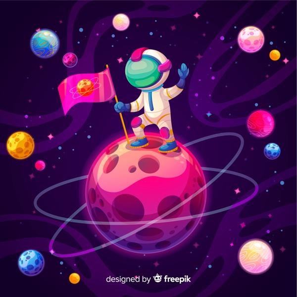

<h1 align="center">
  
  BOOTCAMP GAME
  
</h1>

 Status <☕>Finalizado<☕/> HTML | CSS | JavaScript 

# Desafio DIO | Jogo da Cobrinha

Para esse desafio foi proposto a reprodução do famoso "Jogo da Cobrinha" em JavaScript. Minha versão traz nova roupagem e significantes.

### [🚀] Conceito

- O céu intergaláctico representa a DIO cheia de planetas e estrelas para explorar. O foguetinho representa cada bootcamp, os quais é preciso consumir e finalizar para aumentar conhecimento e experiência em TI.

### [🚀] Jogabilidade

- O objetivo é capturar o foguetinho neon - que a cada captura muda de lugar na tela - para aumentar o rastro da trilha verde.

- Para iniciar o jogo basta utilizar as setas de direção "cima" "baixo" "esquerda" "direita" para se movimentar.
- Para sair = tecla "F5".

## 📁 Acessibilidade:

- Para ler os códigos fonte, basta acessá-los diretamente nesse repositório.     

- Para acessar a page e jogar, clique na imagem abaixo com o *scroll* ou com o botão direito do mouse para abrir em nova aba:

<td align="center">
    
</td>

## :hammer_and_wrench: Tecnologias Utilizadas:

- *HTML5* : estrutura da page & linkagem.

- *CSS3* : técnicas de estilização para layout.

- *JavaScript* : algoritmos do jogo.

- *Bootstrap* : framework.

- *Git* & *GitHub* : deployer e repositório.

- *VSCode* : IDE. 

# Encerramento do Bootcamp: HTML Web Developer | De 21 de fevereiro à 15 de Março 2022.

O desafio do game levou 2 dias para execução desde o passo-a-passo da aula Snake Game, reconceitualização, adaptações da interface e layout, refatoração dos códigos à entrega do projeto.

## :octocat: A Autora: 

<table>
  <tr>
    <td align="center">
      <a href="#">
         
        
          <b>Debh Valois</b>
        
      </a>
    </td>
  </tr>
</table>

